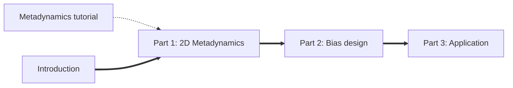

```mermaid
flowchart LR
intro[Introduction]
metad[Metadynamics tutorial]
part1[Part 1: 2D Metadynamics]
part2[Part 2: Bias design]
part3[Part 3: Application]
metad -.-> part1
intro ==> part1
part1 ==> part2
part2 ==> part3
click intro "INTRO.md" "Introduction to the tutorial"
click metad "metad" "If you are new to Metadynamics, you should complete this masterclass"
click part1 "PART1.md" "Part 1: Use 2D Metadynamics to characterize the free-energy barriers for magnesium-phosphate binding"
click part2 "PART2.md" "Part 2: Design a barrier-flattening potential and test it"
```
