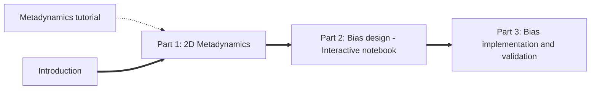

```mermaid
flowchart LR
intro[Introduction]
metad[Metadynamics tutorial]
part1[Part 1: 2D Metadynamics]
inb[Part 2: Bias design - Interactive notebook]
validate[Part 3: Bias implementation and validation]
metad -.-> part1
intro ==> part1
part1 ==> inb
inb ==> validate
click intro "INTRO.md" "Introduction to the tutorial"
click metad "metad" "If you are new to Metadynamics, you should complete this masterclass"
click part1 "PART1.md" "First part: using 2D Metadynamics to characterize the free-energy barriers for magnesium-phosphate binding"
click inb "notebooks/InteractiveBias.ipynb" "A Python notebook to interactively parameterize a barrier-flattening potential"
```
