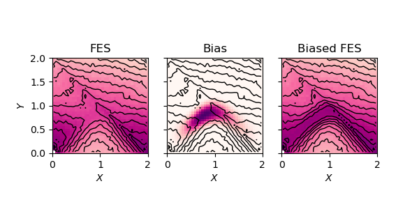
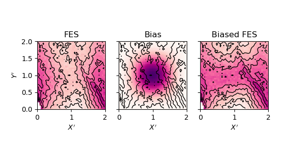
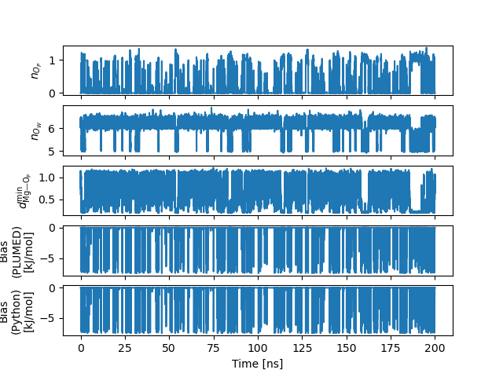

# Part 2: Design a barrier-flattening potential

Now that we have a clear picture about the free-energy surface (FES) we can devise a strategy to accelerate the dynamics along the most probable reaction pathway.

The idea behind this approach is to lower the free energy barrier between the bound and the unbound states in the hope of increasing the reaction rate in both directions. In the language of transition state theory (TST), this corresponds to decreasing the (Gibbs) free energy of activation for both the forward and backward processes ($\Delta^\ddagger G_\pm$) in order to increase the corresponding rate constants,

$$
\begin{equation}
k_\pm \propto e^{-\frac{\Delta^\ddagger G_\pm}{k_B T}}.
\end{equation}
$$

We will use the FES previously computed to craft a barrier-flattening bias. For this, no further simulation is needed as we can directly predict the shape of the FES for any bias potential that is a function of the same variables,

$$
\begin{equation}
G(x, y) = G_0(x, y) + U_\text{bias}(x, y).
\end{equation}
$$

## Choosing a functional form

The choice of $U_\text{bias}$ is rather free, but we need to take some constraints into account:
- It should be continuous
- Far away from the barrier, the bias should be flat so as to minimally affect the thermodynamic ensemble
- The bias should avoid creating stable intermediates

### Instructions

1) Propose a candidate functional form matching the above criteria.

> [!TIP] Tip 1
> Try to transform the input variables so as to make it easier to fit the barrier with common functions (exp, cos, polynomials, etc.)

> [!TIP] Tip 2
> Use Heaviside step functions to restrict the bias to the section of the CV-space you are interested in. Make sure the resulting potential is continuous (and it’s probably a good idea if it’s differentiable too) everywhere the system can go.

2) Using the reweighted FES computed in [Part 1](PART1.md), predict the shape of the biased FES and plot it.

3) Adjust the parameters and/or the functional form until you are satisfied with the resulting free-energy barrier.

### Results

Here is our proposition. For convenience, we defined new variables $X$ and $Y$ as:

$$
\begin{align}
X &= n_{O_P} - n_{O_W} + 6 \\
Y &= n_{O_P} + n_{O_W} - 6
\end{align}
$$

where $X$ can be interpreted as the advancement of the O<sub>W</sub>/O<sub>P</sub> exchange ($X = 0$ is the unbound state, $X = 1$ represents the addition of O<sub>P</sub> to the inner-sphere, and $X = 2$ complete departure of the supranumerary O<sub>W</sub> atom) and $Y$ is the excess coordination relative to the basal $n = 6$.



<details><summary>(Click to) See the functional form details.</summary>

$$
U_\text{bias}(X', Y') = -1.875 \cdot\theta(X')\theta(2-X')\theta(Y')\theta(2 - Y')(1 - \cos(X'\pi))(1 - \cos(Y'\pi)) \\
X' = X + 0.12 (1 - \cos(X\pi)) \\
Y' = 2.8Y - 0.7(1 - \cos(X\pi))
$$


</details>

Your solution will probably look different, and that's OK since precise shape of the barrier should not matter too much.

## Testing the barrier-flattening bias

Once you are satisfied with functional form of your bias, you can implement it in a Plumed file.

### Instructions

1) Prepare a new directory for the bias testing simulation (you can reuse the same input files as previously).

2) Write a `plumed_bias.dat` file implementing the chosen bias. You will to define a [`CUSTOM`](https://www.plumed.org/doc-v2.9/user-doc/html/_c_u_s_t_o_m.html) collective variable and turn its output value into a biasing potential with [`BIASVALUE`](https://www.plumed.org/doc-v2.9/user-doc/html/_b_i_a_s_v_a_l_u_e.html). 

3) To avoid wasting time with free diffusion of the ion in the simulation box, restrain the Mg<sup>2+</sup> in the vicinity of the O<sub>P</sub> atoms. For example you can use an upper wall on the minimum Mg—O<sub>P</sub> distance to restrain it under $1~\text{nm}$ using the [`DISTANCES`](https://www.plumed.org/doc-v2.9/user-doc/html/_d_i_s_t_a_n_c_e_s.html) multicolvar with the appropriate keyword.

4) Run the simulation.

5) In a Python notebook, plot the timeseries for the two CVs of interest as well as $U_\text{bias}(t)$.

### Template PLUMED file

```plumed
#SOLUTIONFILE=solutions/inputs/plumed_bias.dat
# Barrier-flattening bias for accelerating Mg (un)binding to phosphate oxygen
mg: GROUP __FILL__
op: GROUP __FILL__
ow: GROUP __FILL__

nop: COORDINATION ...
   __FILL__
...

now: COORDINATION ...
   __FILL__
...

dop: DISTANCES ...
   __FILL__
...

uwall: UPPER_WALLS __FILL__

bias_fn: CUSTOM ...
   __FILL__
...

bias: BIASVALUE __FILL__

PRINT ARG=nop,now,dop.lowest,uwall.bias,bias.bias STRIDE=500 FILE=bias.COLVAR
```

### Results



## Reweighting

If we want to recover the original statistics implied by the force field, we need to reweight out the contribution of our accelerating bias. Each frame of the biased trajectory will receive a weight

$$
\begin{equation}
w(t) \propto \frac{p_0(t)}{p_\text{bias}(t)} = \frac{e^{-\beta U_0(t)}}{e^{-\beta [U_0(t) + U_\text{bias}(t)]}} = e^{\beta U_\text{bias}(t)}.
\end{equation}
$$

Any observable we are interested in can then be estimated using a weighted average on the $N$ frames from our biased trajectory as

$$
\begin{equation}
\langle \mathcal{O} \rangle_{p_0} \approx \frac{1}{N} \sum_{i=1}^{N} w(t_i)\mathcal{O}(t_i).
\end{equation}
$$

The quality of our estimation, however, will depend on the phase space overlap between the biased and unbiased ensembles. A generic way of evaluating the efficiency of our reweighting scheme is to use the Kish effective sample size,

$$
\begin{equation}
N_\text{Kish} = \frac{(\sum_{i=1}^{N}w_i)^2}{\sum_{i=1}^{N}w_i^2}.
\end{equation}
$$

We can interpret $N_\text{Kish}$ as the effective number of sample frames that contribute to the weighted average. In the worst case scenario, $N_\text{Kish} = 1$ and only one frame has a non-zero weight, resulting in a very poor estimate of $\langle \mathcal{O} \rangle_{p_0}$. The higher $N_\text{Kish}$, the better the statistics, with a maximum value at $N_\text{Kish} = N$ for trivial reweighting (e.g. for a constant bias).

### Instructions

1) Compute the Kish effective sample size corresponding to reweighting the simulation to the original force field.

> <details><summary><b>Q:</b> How do you expect the Kish size to vary when increasing the number of magnesium ions (each ion contributing one bias potential) and RNA binding sites?</summary>
> <b>A</b>: Assuming independent Mg<sup>2+</sup>/binding site pairs, we expect the Kish size to decrease faster than linearly with the number of ions. This is because, for a frame to have a significant weight, all biases should simultaneously have a small contribution, <i>i.e.</i> be far from the barrier. This becomes combinatorially unlikely as the number of Mg<sup>2+</sup> increases.</details>

